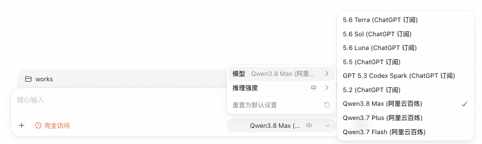

# codex-switch

为 Codex 提供多模型路由的极薄本地代理：一个 Codex provider 连接多个上游 provider。

核心承诺：

- **不改应用层 payload**：只读取请求 JSON 里的 `model` 字段做路由，不改写应用层 JSON 或 SSE event/data；正常 HTTP 代理仍会处理 hop-by-hop、认证和传输编码相关 header。
- **Responses 边界清楚**：只有已确认存在 OpenAI Responses 接口的厂商才能保存为直连路由；仅兼容 Chat Completions 的厂商不会伪装成可用。
- **纯配置**：路由来自 `config.toml`，无数据库；厂商连接信息热加载，模型目录更新后重启 Codex 生效。
- **本地管理页**：可搜索厂商、检测 Key、发现并筛选模型、查看能力来源、备份/还原配置，并把模型目录应用到 Codex。

详细设计见 [DESIGN.md](DESIGN.md)。

## 全新安装的默认状态

全新安装只有 ChatGPT 订阅 provider，不再默认内置阿里云百炼或任何第三方 API provider。升级不会删除用户已有的百炼或其他 provider 配置。

Codex 的模型选择器会把启用 provider 的模型合并展示。选中模型后，codex-switch 按原始 model ID 选择上游：ChatGPT 订阅沿用 Codex OAuth，第三方 API 替换为对应 Bearer 凭证；应用层 JSON 和 SSE payload 不改写。作为正常 HTTP 代理，它会剥离 hop-by-hop header、替换认证，并在 `fetch` 可能解压响应后移除不再准确的 `content-length` / `content-encoding`。

Responses SSE 的连接生命周期也随下游绑定：Codex 取消请求、关闭响应，或在上游返回 header 前断开时，代理会取消对应的单次上游 `fetch` 并销毁响应流；正常完成的 SSE 不会被误取消。代理不会自动重试 `POST /responses`，避免一次取消或网络错误导致同一推理被重复执行。



## 厂商目录与 Responses 兼容性

添加供应商时可以按中英文名称或 ID 搜索。状态描述的是 Codex 实际使用的 Responses 协议兼容性，不等同于“有 OpenAI SDK”或“能调用 `/chat/completions`”。

| 厂商 | Responses 状态 | 连接与模型发现 |
|---|---|---|
| OpenAI API | supported | 固定 URL；`GET /models`，合并静态能力 |
| xAI | supported | 固定 URL；Key 检测与 language-models 发现 |
| OpenRouter | supported | 固定 URL；检测 Key，优先发现当前 Key 可用模型 |
| Groq | beta | 固定 URL；Responses Beta；`GET /models` |
| Fireworks AI | supported | 固定 URL；`GET /models`，合并静态能力 |
| 百度千帆 | supported | 固定 URL；`GET /models` |
| 火山方舟 | supported | 不执行可能计费的探测；显示静态参考模型，必须手工填写 Endpoint ID |
| 腾讯 TokenHub | limited | 中国站/国际站动态 URL；只保留 Responses 协议矩阵中的在线模型 |
| 阿里云百炼 | limited | 按 region/workspace 动态 URL；原生分页模型发现，部分 Responses 参数有限制 |
| AWS Bedrock | supported | 按 region 动态 URL；`GET /models` |
| Azure OpenAI / Microsoft Foundry | supported | 按 resource endpoint 动态 URL；必须手工填写 Deployment ID |
| Cloudflare Workers AI | limited | 按 account ID 动态 URL；使用官方静态 Responses 模型白名单，不探测 Token |
| NVIDIA NIM（自托管） | limited | 用户提供部署 URL；Responses 能力取决于 NIM 版本和模型 |
| Custom | limited | 用户提供 URL；尝试 `GET /models`，成功发现模型也不等于已证明 Responses 兼容 |

以下热门厂商仍可搜索，但当前官方直连 API 未确认支持 Codex 所需的 Responses 协议，因此不能直接保存：Kimi、GLM、DeepSeek、Google Gemini、Anthropic Claude、Mistral AI、Together AI、Cerebras、硅基流动。

如果目标模型在 OpenRouter 可用，可以在“不支持直连”的说明里点“改用 OpenRouter”，再用 OpenRouter Key 搜索该模型。也可以选择 Custom 连接用户自己已经验证过的 Responses 网关；codex-switch 不提供 Responses 到 Chat Completions 的协议转换。

## 添加供应商

打开 `http://127.0.0.1:8787/`，点“添加供应商”：

1. 搜索并选择厂商，先阅读 supported / beta / limited / unsupported 兼容状态。
2. 填写厂商连接字段。固定和动态 URL 都由本地服务端重新计算；只有 Custom 和自托管 NIM 可填写 URL。
3. 输入 API Key。停顿 700 ms 会自动检测，离开输入框会立即检测，也可以手工重试。
4. 搜索发现结果并多选模型；没有发现接口时可以手工添加 model ID。
5. 火山方舟必须填写实际 Endpoint ID，Azure 必须填写实际 Deployment ID；页面里的底座模型只是参考，不能当作路由 ID 保存。
6. 保存后，到“配置历史”点“应用并备份”，再重启 Codex 让新的模型目录生效。

Key/连接检测不是简单布尔值，页面会区分：`valid`、`invalid`、`forbidden`、`rate_limited`、`unreachable`、`unsupported` 和 `unverified`。静态目录、手工 deployment，以及无法执行无费用验证的厂商会明确显示为未验证；首次真实 Codex 请求仍是最终可用性依据。

模型能力用 ✓ / × / ? 三态表示 `true` / `false` / `unknown`，不会把厂商没返回的字段误判为不支持。能力还会标注 API、静态、未知、手动或参考来源。生成 Codex catalog 时的优先级是：`config.toml` 手工覆盖 > provider 发现缓存 > 内置静态表 > 保守默认。

## 安装

### macOS App（DMG）

适用于 Apple Silicon（arm64）Mac，无需预装 Node 或 git。发布 GitHub Release 后，GitHub Actions 会从该精确 tag 自动构建 `CodexSwitch-<版本>-macos-arm64.dmg` 和同名 `.sha256`，验证签名、DMG 与 checksum 后再成对上传。Release 必须保持 `immutable=false` 直到资产上传完成；如果 GitHub REST 不返回 `immutable` 字段，或 Release 已 immutable，workflow 会安全失败而不会猜测或覆盖资产。

Release 发布与 DMG asset 上传存在异步窗口。一键安装器只查询一次 `latest` 来锁定 tag，随后在最长 15 分钟的真实墙钟时限内轮询这个精确 tag（API 请求与退避都计入）；只有 Release 的 `assets` 数组中恰好各有一个同名 DMG 和 `.sha256`，且两者状态都是 `uploaded`，才会下载。checksum 格式和内容校验通过后才会挂载。它不会退回旧版本；超时会显示锁定的 Release 页面和安全的 exact-tag 重跑命令。

一键安装：

```sh
curl -fsSL https://raw.githubusercontent.com/cnwenf/codex-switch/main/scripts/install-app.sh | sh
```

若需要继续等待一个已经锁定的 Release（例如自动构建尚未完成），使用安全的 exact-tag 模式；它仍会等待 DMG/checksum 成对出现并执行校验：

```sh
sh scripts/install-app.sh --release-tag v0.5.0
```

也可以从 [Releases](https://github.com/cnwenf/codex-switch/releases/latest) 手工下载 `CodexSwitch-<版本>-macos-arm64.dmg`，或用本地 DMG 安装：

```sh
sh scripts/install-app.sh /path/to/CodexSwitch.dmg
```

显式传入 DMG URL 或本地路径时，安装器不会访问 GitHub Release API，也不会强制下载远端 checksum，适合测试或离线安装；这两种模式属于手工信任来源，不会作为自动安装超时后的安全重跑建议，需要使用者自行确认可信性。

浏览器下载的 ad-hoc 签名 App 可能带 macOS 隔离属性。首次打开可在 Finder 中右键“打开”，或执行：

```sh
xattr -cr "/Applications/Codex Switch.app"
```

App 默认用 macOS LaunchAgent 在登录时启动，菜单栏可查看状态、打开配置页、检查更新或退出。退出 App 会剥离 codex-switch 注入的 Codex 配置，保留 Codex 自己的其他设置。

源码启动和打包 App 启动都会为 child Node 合并已有 `NODE_EXTRA_CA_CERTS` 与 macOS system/login keychain 证书，供企业 HTTPS 代理环境使用；已有 CA 文件不会被改写。证书内容不会写入 `run.log`，日志只会记录最终 bundle 路径。

### 源码安装

需要 Node.js 20+：

```sh
git clone https://github.com/cnwenf/codex-switch.git
cd codex-switch
./install.sh
```

常用命令：

| 命令 | 作用 |
|---|---|
| `./install.sh` | 安装依赖并启动/升级服务 |
| `npm start` | 启动服务 |
| `npm stop` | 停止服务 |
| `npm status` | 查看状态 |
| `open http://127.0.0.1:8787/` | 打开配置页 |

## 管理页

v0.5.0 的管理页采用浅色冷灰画布、不透明表面和单一蓝色主色，供应商以记录列表展示；移动端的编辑界面是带固定头尾操作区的全屏 sheet。厂商和模型都是可搜索、可键盘操作的 combobox，状态同时使用文字和图标，不只依赖颜色。

页面保留供应商 CRUD/启停/复制、配置历史与还原、Codex 应用与还原、开机自启、更新检查、模型发现和能力刷新。视觉重设计没有改变这些 API、payload、路由规则或保存动作。

## 安全边界

- 默认配置把服务绑定到 `127.0.0.1:8787`；这才是管理页、发现 API 和 Key 操作的安全部署边界。若手工把 `proxy.listen` 改到非 loopback / 非回环地址，无认证管理面和显式 Key 导出接口都会暴露给该网络，存在配置篡改和凭据泄露风险，强烈禁止这样部署。
- 固定和动态厂商 URL 由服务端 registry 重新解析，浏览器提交的派生 URL 不是权威值。
- Custom 和 NIM 只允许 HTTPS，或 loopback HTTP；发现请求限制同源跳转并阻止公网/loopback 目标类别切换，降低 SSRF 与凭证转发风险。
- 每个发现请求 10 秒超时，响应最多 4 MiB，最多 3 次同源跳转、5 页和 2,000 个模型；上游正文、堆栈和包含 Key 的模型字段不会返回。
- API Key 只通过管理 POST body 参与检测，不进入 URL 或日志。管理页新增/轮换的 Key 位于 `~/.codex-switch/env`（mode `0600`），新配置只保存环境变量名。旧版 `config.toml` 的 inline `token` 仍能兼容读取，应尽快迁移到 env 文件并移除明文。
- 上游连接失败的 502 只返回稳定的脱敏 `code`，并在 `run.log` 记录同一个 code；不会返回或记录上游 URL、异常 message、header 或凭证。当前公开码包括 `EMFILE`、`ECONNRESET`、`ETIMEDOUT`、`ENOTFOUND`、`EAI_AGAIN`、`TLS_CERT`，其他原因统一为 `UNKNOWN`。
- 正常列表、编辑和检测遵守“Key 不回显”：不会回填已保存值。现有“复制为 JSON”是明确的敏感导出操作，可能把 Key 写入剪贴板；页面会标注“含 API Key，勿外传”。
- Codex 的 `~/.codex/auth.json` 和 `~/.codex/config.toml` 只读或手术式合并；应用前自动备份，可一键还原，不覆盖无关配置。

## 工作原理

```text
Codex  ──▶  http://127.0.0.1:8787/v1  ──▶  codex-switch
                唯一 model_provider          │  读 body.model 查路由表
                                              ├─▶ 订阅模型 ──▶ ChatGPT（OAuth 透传）
                                              └─▶ 第三方模型 ──▶ Responses API（Bearer 替换）
```

Codex 侧配置由管理页“应用并备份”生成，核心形态是：

```toml
model_catalog_json = "~/.codex/catalog.json"

[model_providers.codexswitch]
name = "codex-switch"
base_url = "http://127.0.0.1:8787/v1"
wire_api = "responses"
requires_openai_auth = true
```

模型 ID 必须和上游路由 ID 完全一致，因为代理不会改写 body 里的 `model`。

如果长时间运行后看到 `502`，先查看 JSON 的 `code` 或 `~/.codex-switch/run.log` 中的同名脱敏 code。`EMFILE` 表示进程文件描述符耗尽；当前版本会在下游取消时同步关闭上游 SSE，修复旧版本反复取消会话后连接累积、最终出现 `EMFILE` 的问题。升级后若仍出现该 code，应记录复现次数和 FD 变化继续排查，而不是自动重放 POST。

## 验证边界

仓库自动化测试使用本地 stub server 覆盖 registry、adapter、Key 脱敏、SSRF/跳转、分页/大小限制、TOML 持久化、管理 API 和 UI 交互。是否用真实厂商 Key 做过 live 验证必须在具体发布验收中单独报告；文档或 stub 测试通过不代表已经完成 live-key 验证。

## 许可

MIT
